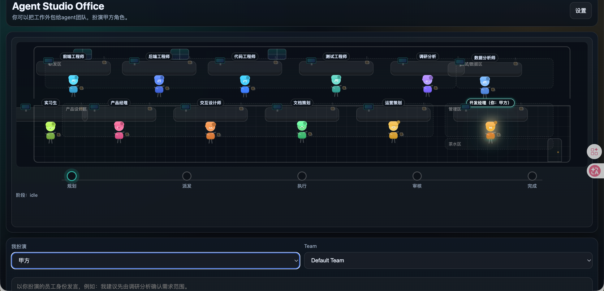

# Agent Studio MVP

多agent协同，调用本地订阅CLI的方式。

一个本地可运行的多 Agent 网页控制台（AutoGen Studio 风格 MVP），现已升级为“办公室动画主界面”。




支持：
- 办公室主界面（小人动画场景为主视觉）
- `设置` 抽屉（Models / Agents / Teams / Trace 收纳到设置面板）
- 甲方/角色扮演模式（可扮演甲方或不同员工）
- 点击办公室小人直接切换扮演角色
- 角色头顶气泡展示你的输入（办公室内对话感）
- 模型配置（本地 CLI：`claude` / `codex` / `gemini`）
- Agent 配置（角色、system prompt、specialties）
- Team 配置（manager + 成员）
- 团队运行策略：`single-route` / `broadcast` / `manager-decide` / `manager-orchestrate`
- 成员并行执行、超时跳过、取消运行
- 进度条与运行阶段提示
- 2D 动画流程展示（规划/派发/执行/审核/完成）
- 办公室分区（研发区/产品设计区/测试数据区/管理区/茶水区）
- 卡片式回答展示（成员回答 + 开发经理总结）
- 调试信息折叠（默认隐藏）
- 模型测试按钮（验证非交互参数）

## 快速开始

```bash
npm install
npm start
```

打开：`http://localhost:3000`

## 环境要求

- Node.js 18+
- 可选（如果要跑真实模型）：本机已安装并可直接执行以下 CLI
  - `claude`
  - `codex`
  - `gemini`

## 功能说明

### 0. Office 主界面（推荐入口）
- 主界面是办公室动画场景（小人、工位、门窗、茶杯、消息流）
- 你可以在 `我扮演` 中选择角色（含 `甲方`）
- 也可以直接点击办公室中的小人切换角色
- 你的输入会显示在该角色头顶气泡里，并以该角色身份参与协作
- 其他配置项默认收纳到 `设置` 按钮中（抽屉面板）

### 1. Models
配置本地命令行模型适配器：
- `command`：执行命令（例如 `codex`）
- `argsTemplate`：参数模板，使用 `{{prompt}}` 注入提示词

示例：
- `claude`: `-p "{{prompt}}"`
- `codex`: `exec "{{prompt}}"`
- `gemini`: `"{{prompt}}"`

点击 `Test Model` 可快速验证当前模型是否能以非交互方式执行。

### 2. Agents
配置 Agent：
- 名称
- 角色（manager/specialist）
- 模型绑定
- system prompt
- specialties（用于关键词路由）

### 3. Teams
配置团队：
- manager agent
- 成员列表
- 策略（strategy）

策略说明：
- `single-route`: manager/关键词逻辑选择一个成员执行
- `broadcast`: 所有成员并行执行，开发经理汇总
- `manager-decide`: 先让 manager 规划，再决定单路由或广播
- `manager-orchestrate`: 开发经理拆解任务 -> 分配成员 -> 成员执行 -> 审核完成度 -> 汇总（含完成率）

### 4. 角色扮演（甲方/员工）
可扮演角色示例：
- 甲方
- 产品经理
- 交互设计师
- 测试工程师
- 运营策划
- 数据分析师
- 前端工程师
- 后端工程师
- 实习生
- 代码工程师 / 文档策划 / 调研分析

说明：
- 扮演角色是“前台交互身份”，用于沉浸式对话和办公室场景展示
- 团队内部执行仍由 Team 配置中的 agent 决定（后端逻辑）

## 运行与展示

- 运行时显示阶段进度（规划 / 派发 / 执行 / 审核 / 汇总）和进度条
- 支持 `Cancel` 提前终止当前运行
- 办公室场景中的角色具有：
  - 不同配色、发型、表情（思考/说话/完成）
  - 路径移动动画（去经理桌前汇报再返回）
  - 头顶逐字气泡
  - 工位名字牌（可高亮“你”的角色）
- 输出区为卡片式消息：
  - 每个成员 agent 一张卡片（只显示回答内容）
  - 最后一张为 `开发经理` 总结
  - 调试信息默认折叠（stderr / code / model 等）

## 数据存储

本地配置默认保存到：

- `data/studio-config.json`

> 该文件已被 `.gitignore` 忽略，不会上传到 GitHub。

## 已知限制（MVP）

- 依赖本机 CLI 的非交互参数正确配置，否则可能等待输入直到超时
- `manager-decide` 规划输出为模板/JSON 解析，解析失败会自动回退 `broadcast`
- `manager-orchestrate` 目前为 MVP 版编排，任务审核逻辑基于结构化输出 + fallback 规则
- 办公室小人动画目前为前端 CSS/DOM 动画（非骨骼动画），复杂动作仍有提升空间
- 前端当前为原生 HTML/CSS/JS（便于快速迭代）

## 后续可扩展

- SSE/WebSocket 流式 token 输出
- 卡片逐步更新（哪个 agent 先完成先落卡）
- 图形化 Team 编排（节点/连线）
- SVG / Rive 角色动画替换当前 CSS 小人
- 办公室镜头聚焦、角色状态牌、群聊对白联动
- API 模型适配（OpenAI / Anthropic / Gemini API）
- 会话历史与项目级工作区隔离
